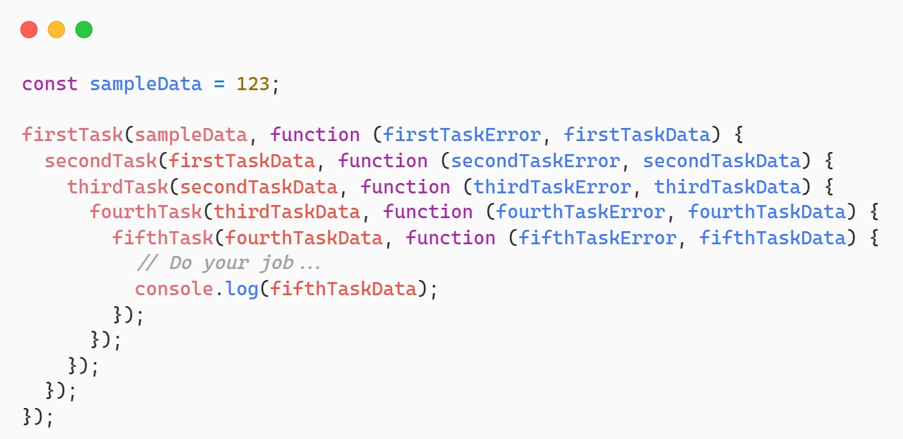

Callback bukanlah satu-satunya cara handle async process. Ada hal yang menyebabkan callback ini ga efektif: kalo suatu tugas bergantung terhadap hasil >= 2 tugas asynchronous seperti case coffee sebelumnya.

```javascript
makeCoffee(order, (makeCoffeeError, makeCoffeeData) => {
  if (makeCoffeeError) {
    console.log(makeCoffeeError);
    return;
  }

  sendCoffee(makeCoffeeData, (sendCoffeeError, sendCoffeeData) => {
    if (sendCoffeeError) {
      console.log(sendCoffeeError);
      return;
    }

    console.log(`Pramusaji memberikan ${sendCoffeeData} pesanan.`);
    console.log(`Saya mendapatkan ${sendCoffeeData} dan menghabiskannya.`);
  });
});
```

Kode tsb oke2 aja, tapi let's say aktivitas meminum kopi ditandai dengan munculnya teks “Saya mendapatkan Kopi Espresso dan menghabiskannya”. Bakal jadi masalah jika proses minum kopi bergantung pada lebih dari dua, tiga, empat, atau lebih async process? Dalam konteks penulisan kode, code akan makin menjorok ke dalam (deeply nested) dan lebih sulit dipahami a.k.a callback hell :o



Ini callback

```javascript
doSomething((doSomethingError, doSomethingData) => {
  if (doSomethingError) {
    console.log(doSomethingData);
  }

  console.log(doSomethingData);
});
```

Ini promise

```
function onFulfilled(doSomethingData) {
  // Do your jobs when "fulfilled" happens…
  console.log(doSomethingData);
}

function onRejected(doSomethingError) {
  // Do your jobs when "rejected" happens…
  console.log(doSomethingError);
}

doSomething().then(onFulfilled, onRejected);
```

Masih bisa ga trapped di callback hell meski pake Promise? Masih bisa wkwkwk

```javascript
makeCoffee(order).then((value) => {
  sendCoffee(value).then((value) => {
    console.log(`Pramusaji memberikan ${value} pesanan.`);
    console.log(`Saya mendapatkan ${value} dan menghabiskannya.`);
  });
});
```

Ujung2nya deeply nester lagi kan, caranya biar engga adalah pastiin return nilai Promise-nya kalo lagi pake chaining method karena `then` akan jalan terus kalo ketemu objek Promise

```javascript
makeCoffee(order)
  .then((value) => {
    sendCoffee(value); // <-- tidak akan dilanjutkan ke then berikutnya.
  })
  .then((value) => {
    console.log(`Pramusaji memberikan ${value} pesanan.`);
    console.log(`Saya mendapatkan ${value} dan menghabiskannya.`);
  })
  .catch((error) => {
    console.log(error.message);
    throw error;
  });
```
